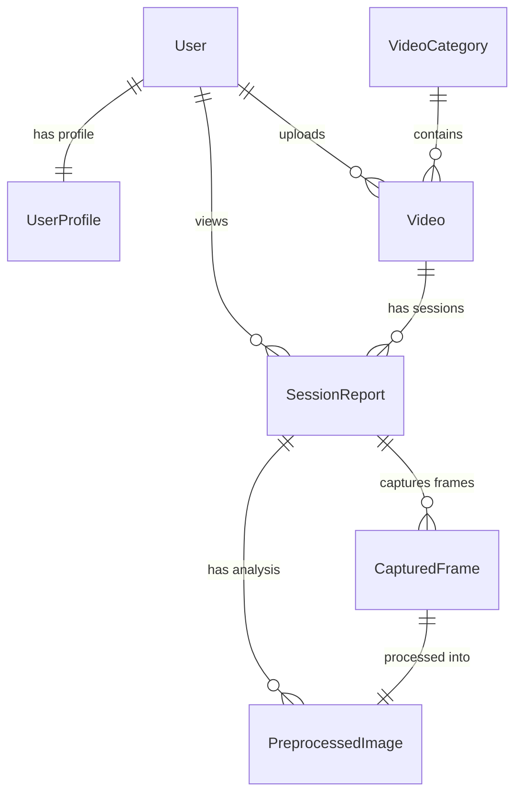

# Database Schema

This document outlines the database schema for the application, detailing the tables, fields, and relationships.

## Core Models

### 1. UserProfile
Extends the standard Django `User` model to add approval status and tracking.

| Field | Type | Description |
|-------|------|-------------|
| `id` | AutoField | Primary Key |
| `user` | OneToOneField | Link to Django `User` model (Cascade delete) |
| `is_approved` | BooleanField | Admin approval status (Default: `False`) |
| `signup_date` | DateTimeField | Date of registration (Auto-add) |
| `approved_by` | ForeignKey | Admin who approved the user (Nullable) |
| `approved_at` | DateTimeField | Date of approval (Nullable) |

### 2. VideoCategory
Categories for organizing uploaded videos.

| Field | Type | Description |
|-------|------|-------------|
| `id` | AutoField | Primary Key |
| `name` | CharField | Unique category name (Max: 100 chars) |
| `description` | TextField | Optional description |
| `created_at` | DateTimeField | Creation timestamp (Auto-add) |

### 3. Video
Stores metadata for uploaded videos.

| Field | Type | Description |
|-------|------|-------------|
| `id` | AutoField | Primary Key |
| `title` | CharField | Video title (Max: 255 chars) |
| `description` | TextField | Optional description |
| `category` | ForeignKey | Link to `VideoCategory` (Set Null on delete) |
| `video_file` | FileField | Path to video file (`videos/`) |
| `duration` | IntegerField | Duration in seconds |
| `thumbnail` | ImageField | Path to thumbnail image (`thumbnails/`) |
| `uploaded_by` | ForeignKey | User who uploaded the video |
| `uploaded_at` | DateTimeField | Upload timestamp (Auto-add) |
| `is_active` | BooleanField | Visibility status (Default: `True`) |

---

## Session & Analytics Models

### 4. SessionReport
Tracks a user's viewing session of a particular video.

| Field | Type | Description |
|-------|------|-------------|
| `id` | AutoField | Primary Key |
| `video` | ForeignKey | Link to `Video` |
| `user` | ForeignKey | Link to `User` |
| `started_at` | DateTimeField | Session start timestamp |
| `completed_at` | DateTimeField | Session completion timestamp (Nullable) |
| `is_completed` | BooleanField | Completion status (Default: `False`) |
| `session_report` | CharField | **Dominant Emotion** for the session (Max: 50 chars) |
| `report_data` | JSONField | Cached full analysis report JSON (Nullable) |

### 5. CapturedFrame
Stores raw frames captured from the video stream during playback.

| Field | Type | Description |
|-------|------|-------------|
| `id` | AutoField | Primary Key |
| `session` | ForeignKey | Link to `SessionReport` |
| `image` | ImageField | Path to captured image (`captures/`) |
| `timestamp` | FloatField | Video timestamp in seconds |
| `captured_at` | DateTimeField | Capture timestamp (Auto-add) |

### 6. PreprocessedImage
Stores the analyzed/processed version of a captured frame and its emotion data.

| Field | Type | Description |
|-------|------|-------------|
| `id` | AutoField | Primary Key |
| `captured_frame` | OneToOneField | Link to source `CapturedFrame` |
| `image` | ImageField | Path to preprocessed image (`preprocessed/`) |
| `expression` | CharField | Detected emotion (e.g., 'happy', 'neutral') |
| `expression_confidence` | FloatField | Confidence score of the detection |
| `all_expressions` | JSONField | Full probability distribution of all emotions |
| `session` | ForeignKey | Direct link to `SessionReport` (Denormalized) |
| `user` | ForeignKey | Direct link to `User` (Denormalized) |
| `video` | ForeignKey | Direct link to `Video` (Denormalized) |
| `created_at` | DateTimeField | Creation timestamp |

## Relationships Diagram

